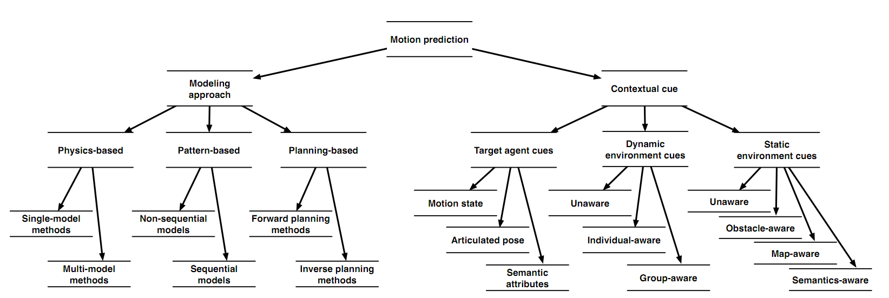

## Human Motion Trajectory Prediction: A Survey
> Andrey Rudenko, Luigi Palmieri, Michael Herman, el al.
> Notes by Ling Kangjie, 2019-06-26

- Where needs human motion prediction? Self-driving vehicles, service robots, and advanced surveillance systems. Self-driving vehicles have to quickly reason about future locations of pedestrians. Surveillance systems provide real-time alerts of pending collisions of traffic participants, detect suspicious activity of human crowd or crowd control. Robot navigation requires accurate motion prediction of surrounding people to safely and efficiently move though crowds.
- What are the challenges of human motion prediction? The complexity of human behavior and the variety of its internal and external stimuli. Stimulus include the goal of agent, relationships of surrounding agents, social rules, environment topology etc. Most factors of stimulus are not directly observable. Real-time prediction.
- Elements of motion prediction: *stimuli*, *modeling approach*, and *prediction*.
- Taxonomy of motion prediction: 
   - **Modeling approach**: a) *physics-based mothods* (Sense-Predict) b)*pattern-based methods* (Sense-Learn-Predict) c) *planning-based methods* (Sense-Reason-Predict)
   - **Contextual cue**: motion state (position, velocity), articulated pose (head orientation, full-body pose etc.), semantic attributes (age, gender, personality etc.), unaware methods (compute motion predictions for the target agent not considering the presence of other agents), individual-aware methods (account for the presence of other agents), group-aware methods, semantics-aware methods of static environment cues (no-go-zones, crosswalks, side-walks, traffic lights, etc.)

