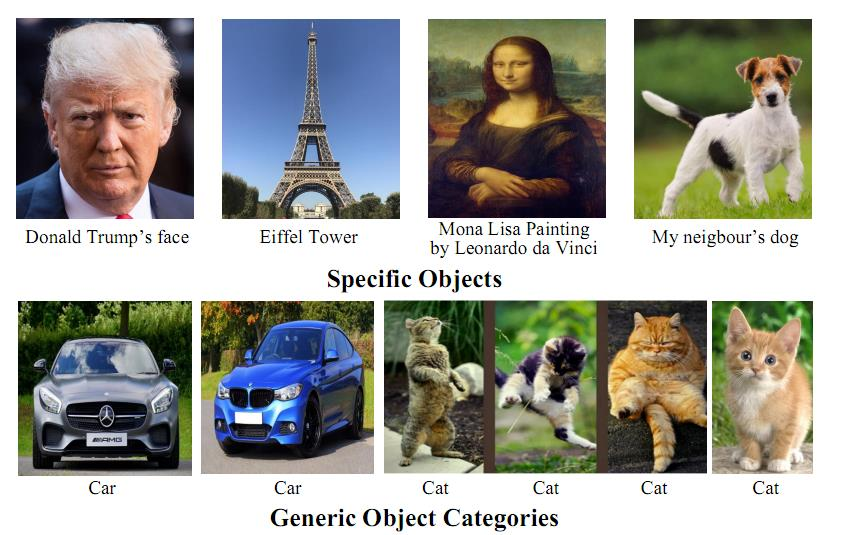
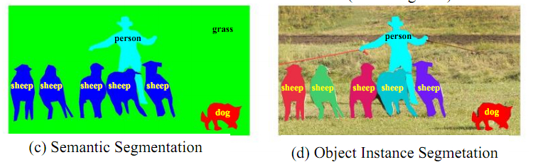
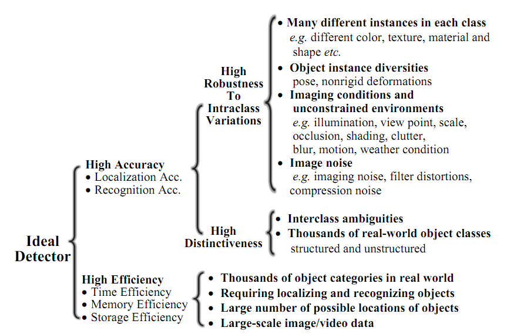
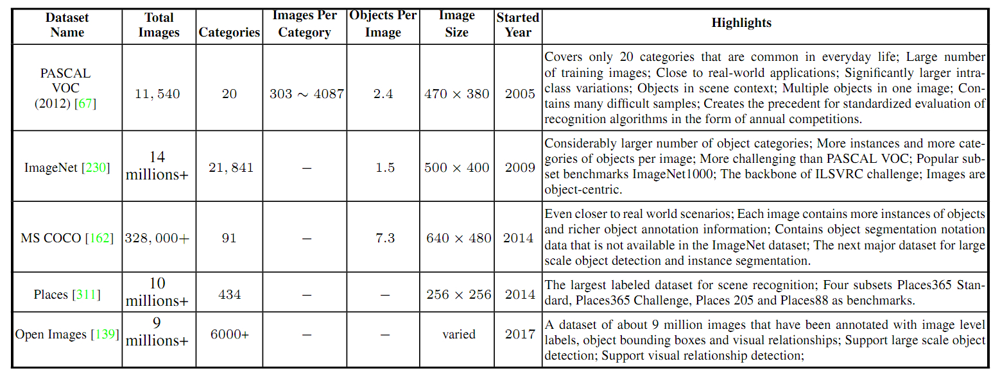

## Deep Learning for Generic Object Detection: A Survey
> Li Liu, Wanli Ouyang, Xiaogang Wang, et al. 2018
> Notes by Ling Kangjie

- Object Detection (OD) has received significant attention in recent years from ICCV and CVPR.
- OD is the basis of high level vision tasks such as segmentation, scene understanding, object tracking, image captioning, event detection, and activity recognition.
- OD can be grouped into two types: detection of specific instances versus the detection of board categories.

- Generic object detection is closely related to *semantic image segmentation*, which aims to assign each pixel in an image to a semantic class label. *Object instance segmentation* aims to distinguish different instances of the same object class, while *semantic segmentation* does not distinguish different instances.

- Currently the research community is primarily interested in the localization of highly structured objects (e.g., cars, faces, bicycles, and airplanes) and articulated objects (e.g., humans, cows, and horses) rather than unstructured scenes (such as sky, grass, and cloud).
- The goals of OD are to achieve *high accuracy* and *high effiency*. The accuracy challenge stems from *the vast range of intraclass variations* and *the huge number of object categories*. The intraclass variations can be divided into two types: intrinsic factors (color, texture, shape, and size), and imaging conditions (sunlight, locations, weather conditions, backgrounds, illuminations, viewing distances, etc.). **huge number of object categories**, a class has many types, such as a dog class has many species.

- Now research community has started moving towards building general object detection systems whose ability to detect many object categories matches that of humans, about 104 - 105 categories.
- Popular databases (PASCAL VOC, ImageNet, MS COCO, and Open Images) for object recognition and detection.

- How to handle intraclass variations? Intraclass variations can be grouped into three categories: *Geometirc transformations in object scale, pose rotation, view-point and part deformations*, *occlusions*, *image degradations (illuminations, blur, motions, low resolution, noise, and weather condictions)*.
   - Handling of geometric transformations. The introduction of local max pooling layers has allowed DCNNs to enjoy small translation invariance. However, the intermediate feature maps in a DCNNs are not actually invariant to large geometric transformations of the input data. Some solutions are to use Spatial Transformer Networks (STN), Deformable Part based Models (DPMs), Deformable Convolutional Networks (DCN).
   - Handling of occlusions. Use synthetic occlusions, use GAN to generates examples with occlusions and deformations, use context information.
   - Handling of image degradations. Nowadays, most popular datasets are clean, and current methods are evaluated in a degradation free and clean environment. Very limited works to address these problems recently.
